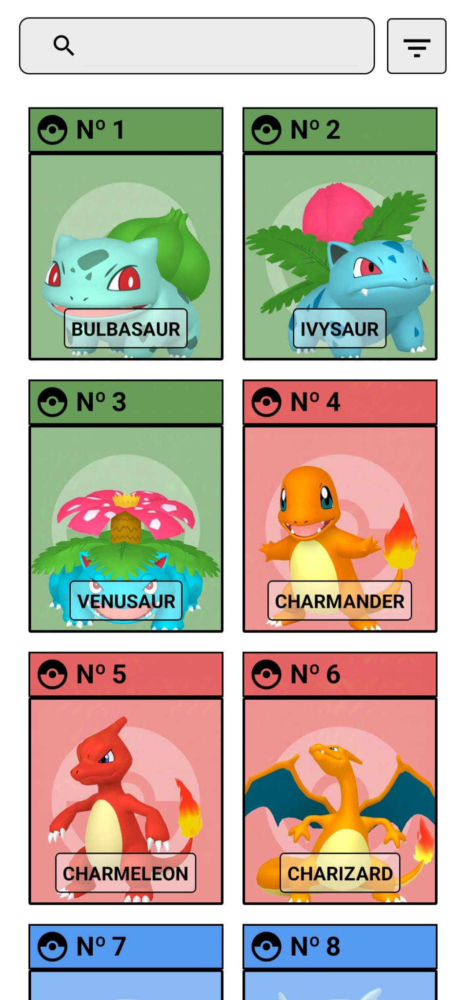
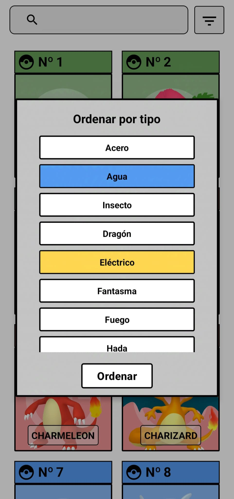
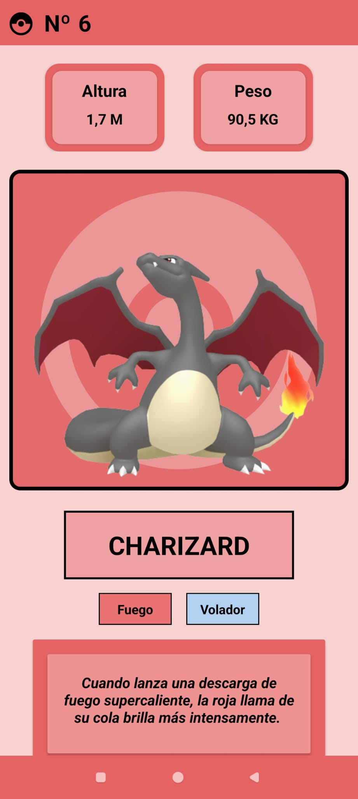
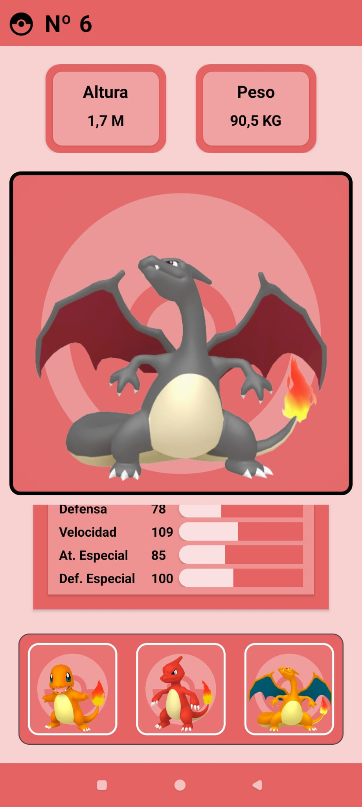

# Pokédex App en Kotlin

Una aplicación de Pokédex desarrollada en **Kotlin** para Android que permite a los usuarios explorar detalles de los Pokémon, incluyendo sus estadísticas, evoluciones y tipos. Además, la app incluye funcionalidades interactivas como la visualización de imágenes, la reproducción de sonidos de los Pokémon y una guía tutorial para usuarios nuevos.

## Características

- 📜 **Listado de Pokémon**: Explora una lista completa de todos los Pokémon.
- 🔎 **Detalles de cada Pokémon**: Visualiza información detallada sobre cada Pokémon como sus estadísticas, tipos, evoluciones y mega evoluciones.
- 🎵 **Sonidos de Pokémon**: Reproduce el sonido del Pokémon al hacer clic en su imagen.
- ✨ **Versiones Shiny**: Visualiza versiones shiny de los Pokémon.
- 📊 **Estadísticas detalladas**: Muestra estadísticas clave como HP, Ataque, Defensa, Velocidad, entre otras.
- 🧭 **Tutorial interactivo**: Incluye un tutorial paso a paso para guiar a los usuarios a través de las funcionalidades clave de la aplicación.

## Tecnologías utilizadas

- **Lenguaje**: Kotlin
- **Frameworks**: Android Jetpack
- **Networking**: Retrofit para hacer llamadas a la API de Pokémon.
- **Manejo de imágenes**: Picasso para cargar las imágenes de los Pokémon.
- **Persistencia**: SharedPreferences para guardar estados de la aplicación.
- **UI**: Material Design, View Binding

## Instalación

### Requisitos previos

- Android Studio instalado
- SDK de Android configurado
- Conexión a Internet (para obtener datos de la API)

## API utilizada

Este proyecto utiliza la [PokéAPI](https://pokeapi.co/) para obtener datos de los Pokémon.

## Cómo usar la aplicación

1. **Explorar Pokémon**: Desplázate por la lista de Pokémon y selecciona uno para ver detalles.
2. **Ver evoluciones**: En la vista de detalles, explora las cadenas de evolución de cada Pokémon. Puedes pulsar en ellas para ir a los detalles de ese Pokemon.
3. **Reproducir sonidos**: Haz clic en la imagen de un Pokémon para escuchar su sonido.
4. **Activar versiones Shiny**: Desliza hacia un lateral sobre la imagen del Pokemon para ver la versión shiny.
5. **Ordenar segun tipos**: Pulsa en el botón de ordenar para realizar busquedas avanzadas de Pokemon de 1 o 2 tipos.
6. **Busca Pokemons**: Puedes hacer busquedas de Pokemons por su número de Id o nombre en la barra superior.

## Capturas de pantalla

## Contribuciones

¡Las contribuciones son bienvenidas! Si tienes ideas o encuentras algún problema, por favor crea un [issue](https://github.com/tu-usuario/nombre-del-repo/issues) o envía un pull request.

## Licencia

Este proyecto está licenciado bajo la [GNU General Public License v3.0](https://www.gnu.org/licenses/gpl-3.0.html). Puedes consultar el archivo `LICENSE` en el repositorio para más detalles.